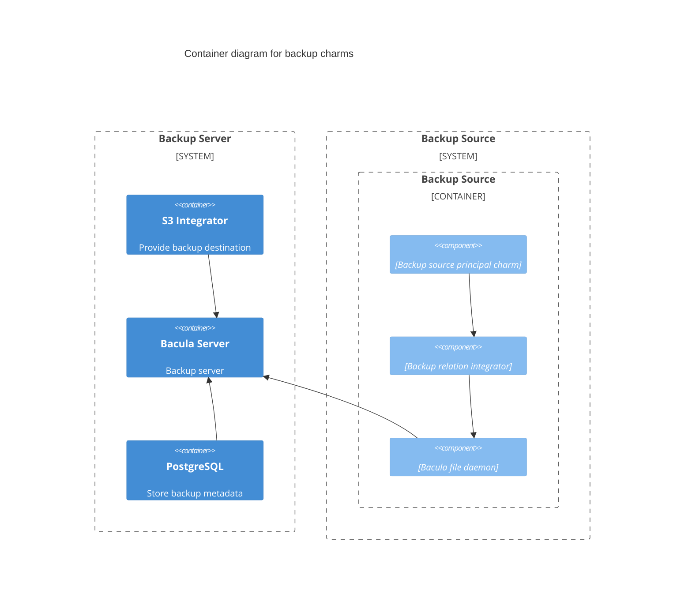
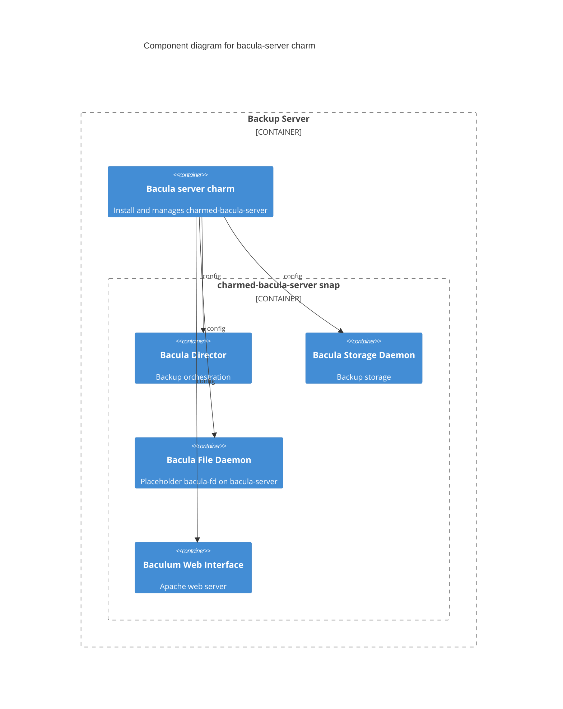

# Charm architecture: Bacula Server charm

The Bacula Server charm is a machine charm that installs and manages all Bacula server components, including the Bacula Director, the Bacula Storage Daemon, and the Baculum web UI. Together, they provide backup orchestration, backup storage for Bacula backup agents, and a user interface for operators.

## High-level overview of backup charms deployment

Here's a typical backup charm suite deployment in the machine charm
environment. It deploys the bacula-server charm as the backup server,
the bacula-fd charm as the backup agent, and the backup-integrator charm
as the backup relation provider.

The backup-integrator charm requests backups from the bacula-fd charm on
behalf of the backup source charm `source`. The bacula-fd charm then
integrates with the bacula-server charm to submit the backup files. The
bacula-server charm is integrated with the PostgreSQL charm for storing
backup metadata and with the s3-integrator charm to use S3 storage as
the destination for backup files.



## Charm architecture

The following diagram shows the architecture of the Bacula server charm:



## Juju events

1. [`config-changed`](https://documentation.ubuntu.com/juju/latest/reference/hook/index.html#config-changed):
   Monitors changes to the backup integrator configuration to update the
   relation data with the latest configuration values.
2. [`leader-elected`](https://documentation.ubuntu.com/juju/latest/reference/hook/index.html#leader-elected),
   [`leader-settings-changed`](https://documentation.ubuntu.com/juju/latest/reference/hook/index.html#leader-settings-changed):
   Monitors changes in the charm’s leadership. Since only the leader
   unit can modify application relation data, triggering a relation data
   update when leadership changes ensures the relation is updated
   regardless of leader status during relation establishment.
3. [`upgrade-charm`](https://documentation.ubuntu.com/juju/latest/reference/hook/index.html#upgrade-charm):
   Triggered when the charm has been upgraded. This ensures that the new
   version of the backup integrator charm can update the relation data
   if needed.
4. [`bacula-peer-relation-changed`](https://documentation.ubuntu.com/juju/latest/reference/hook/index.html#endpoint-relation-changed),  
   [`bacula-peer-relation-created`](https://documentation.ubuntu.com/juju/latest/reference/hook/index.html#endpoint-relation-created), 
   [`bacula-peer-relation-departed`](https://documentation.ubuntu.com/juju/latest/reference/hook/index.html#endpoint-relation-departed):
   Monitors changes, creation, and removal of the `bacula-peer` relation
   to update relation data when needed.
5. [`bacula-dir-relation-changed`](https://documentation.ubuntu.com/juju/latest/reference/hook/index.html#endpoint-relation-changed),  
   [`bacula-dir-relation-broken`](https://documentation.ubuntu.com/juju/latest/reference/hook/index.html#endpoint-relation-broken),
   [`bacula-dir-relation-joined`](https://documentation.ubuntu.com/juju/latest/reference/hook/index.html#endpoint-relation-broken),
   [`bacula-dir-relation-departed`](https://documentation.ubuntu.com/juju/latest/reference/hook/index.html#endpoint-relation-departed):
   Monitors changes, creation, and removal of the `bacula-dir` relation
   to update relation data when needed. And cleanup resources when 
   relation is removed.
6. [`backup-relation-changed`](https://documentation.ubuntu.com/juju/latest/reference/hook/index.html#endpoint-relation-changed),
   [`backup-relation-broken`](https://documentation.ubuntu.com/juju/latest/reference/hook/index.html#endpoint-relation-broken),
   [`backup-relation-departed`](https://documentation.ubuntu.com/juju/latest/reference/hook/index.html#endpoint-relation-departed):
   Monitors changes, creation, and removal of the `backup` relation to
   update relation data when needed.
7. [`secret-changed`](https://documentation.ubuntu.com/juju/latest/reference/hook/index.html#secret-changed), 
   [`secret-removed`](https://documentation.ubuntu.com/juju/latest/reference/hook/index.html#secret-removed):
   Monitors changes or removal of secrets inside relations to update
   configuration when needed.
8. [`s3-relation-changed`](https://documentation.ubuntu.com/juju/latest/reference/hook/index.html#endpoint-relation-changed),
   [`s3-relation-broken`](https://documentation.ubuntu.com/juju/latest/reference/hook/index.html#endpoint-relation-broken): 
   Monitors changes, creation, and removal of the `s3` relation to 
   update relation data when needed.
9. [`postgres-relation-changed`](https://documentation.ubuntu.com/juju/latest/reference/hook/index.html#endpoint-relation-changed),
   [`postgres-relation-broken`](https://documentation.ubuntu.com/juju/latest/reference/hook/index.html#endpoint-relation-broken): 
   Monitors changes, creation, and removal of the `postgres` relation to 
   update relation data when needed.

> See more in the Juju docs: [Hook](https://documentation.ubuntu.com/juju/latest/user/reference/hook/)

## Charm code overview

The `src/__main__.py` file is the default entry point for the backup
integrator charm; it creates an instance of the `BaculaServerCharm`
class (imported from the `charm` module), which inherits from
`ops.CharmBase`. `ops.CharmBase` is the base class from which all charms
are derived, provided by [Ops](https://ops.readthedocs.io/en/latest/index.html)
(the Python framework for developing charms).

> See more in the Juju docs: [Charm](https://documentation.ubuntu.com/juju/latest/user/reference/charm/)

The `__init__` method of `BaculaServerCharm` ensures that the charm observes
and handles all events relevant to its operation.

For example, when a configuration is changed via the CLI:

1. The user runs the configuration command:

```bash
juju config backup-server volume-retention="2 years"
```

2. A `config-changed` event is emitted.
3. In the `__init__` method, the handler for this event is defined as
   follows:

```python
self.framework.observe(self.on.config_changed, self._reconcile_event)
```

4. The `__reconcile_event` method, in turn, takes the necessary actions,
   such as waiting for the backup relation(s) and updating the backup
   relation data.
